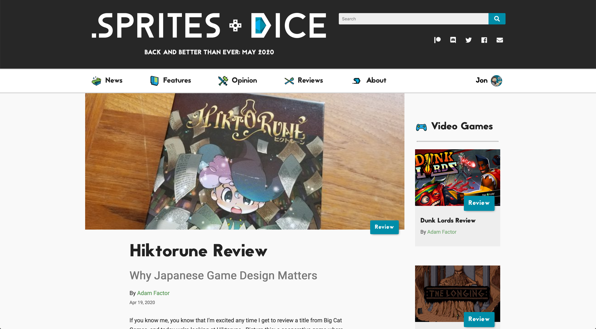
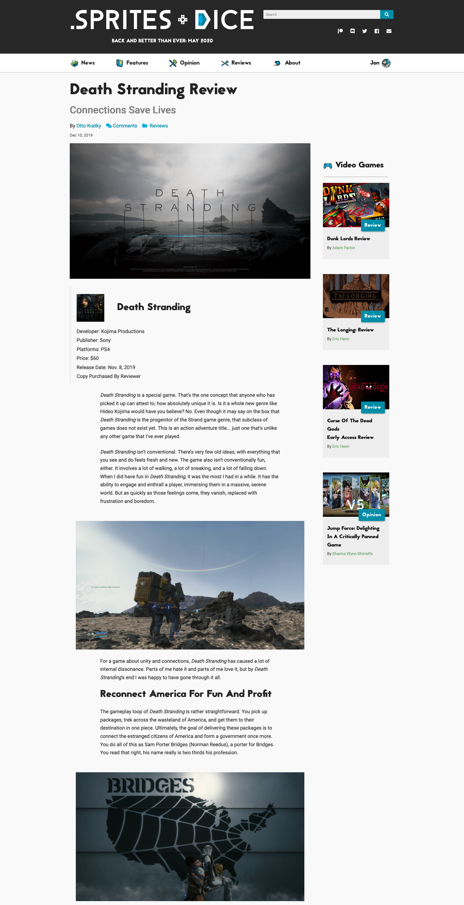
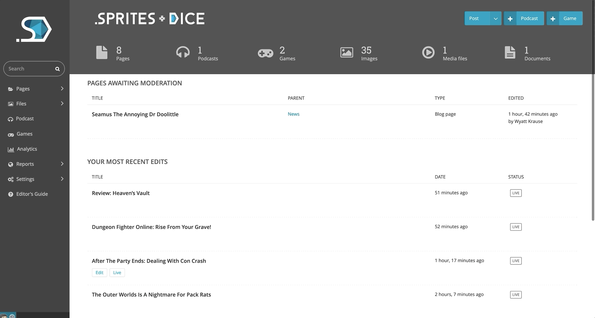
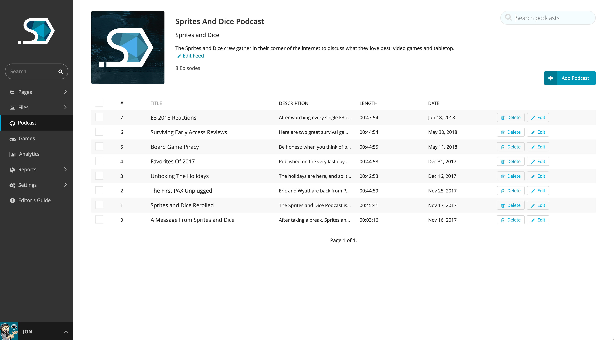

# Sprites and Dice 3.0

A gaming blog and news site built with [Wagtail CMS](https://github.com/wagtail/wagtail/).

-----

## UI Highlights

### Home Page

### Mobile Menu

### Game Review

-----

## Admin Features

### [Podcast Manager](podcast/)

In combination with [Wagtailmedia](https://github.com/torchbox/wagtailmedia/)'s ability to manage .mp3 files, admins can use this Wagtail snippet to create new podcast episodes and edit their `podcast.xml` metadata. Podcasts can be embedded on any page using a custom "Podcast" stream block.

### [Game Manager](game/)

A Wagtail snippet that allows admins to store info like game box art, publishers, MSRP, etc.

### Built-in Analytics Viewer

Powered by [Wagalytics](https://github.com/tomdyson/wagalytics).
